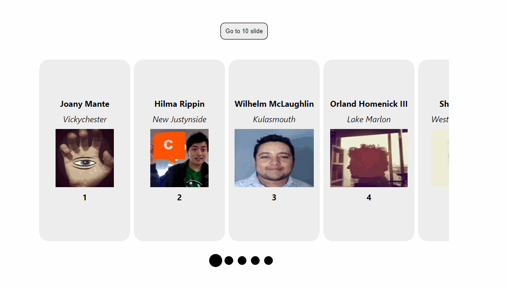
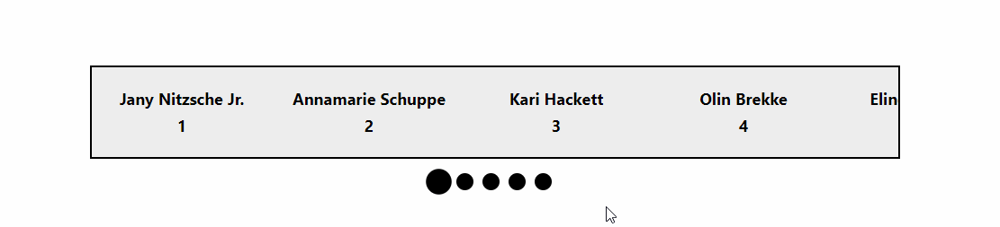

# React Overflow Scroll

## built with and for React

- horizontal scrollbar
- touch support
- dragging and clicking
- smooth scrolling
- universal app support
- customizable styles
- and more...

# Usage examples
